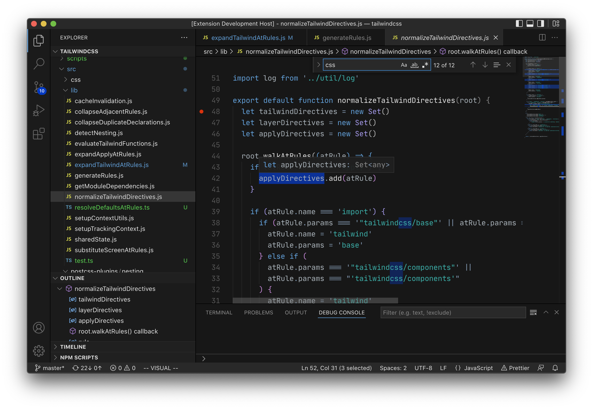
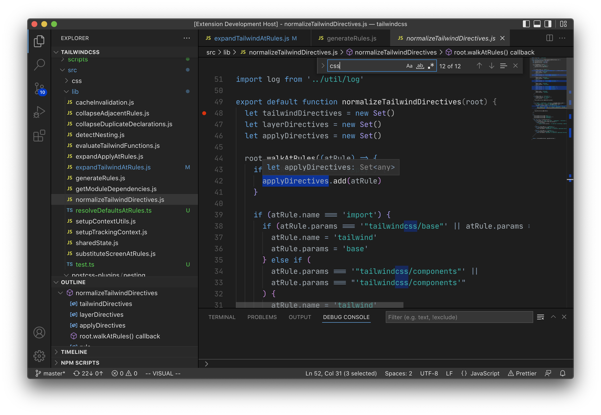

# Base Minor (Visual Studio Code Color Theme)

Basic, neutral color theme. Chrome is inspired by macOS windowing UIs.

## Screenshot

Base Minor Dark Hard

Base Minor Dark Soft

## PRs are welcomed

### Tips

- In the `json` file, `scope` can be an `array` or a `string`
  of CSS classes
- VSCode's `Developer: Inspect TM Scopes` command is useful
  to find out the scope

### Customization

Customizations and tweaks can be made to all six themes at once by:

1.  Saving the customizations in [tokens](src/theme/tokens) for syntax change,
    and/or [workbench](src/theme/workbench) for editor chrome changes,
2.  Running `npm start`, which builds the TypeScript files and launches a
    program that regenerates the six theme files.
